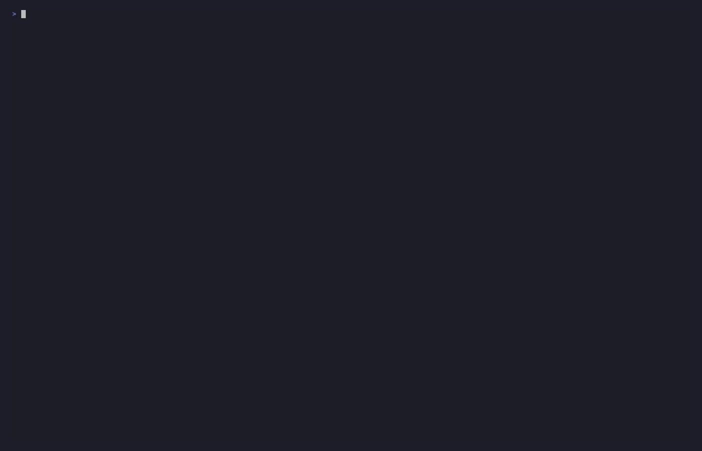

# unleash

**unleash** your agent.

One CLI to rule them all. Install and version-manage Claude Code, Codex, Gemini CLI, and OpenCode from a single CLI. Unified flags, portable conversation histories, self-restart, and hardened sandboxes — so you can rotate between frontier models without fighting four different CLIs.

> **unleash is best run in a sandbox.** Bring your own or use ours — see the [Docker + gVisor sandbox guide](docs/docker.md) for hardened containers with LAN isolation.

<p align="center">
  
</p>

<div align="center">

**Version Manager** — Install, update, and switch between agent CLI versions from one place.

**Unified Flags** — One set of flags across all agents. `-p`, `-m`, `-c` just work.

**Crossload** — Carry conversation histories between agents. Start in Claude, resume in Gemini.

**Extended Capabilities** — Self-restart, auto-mode, plugins, and hardened sandboxes.

</div>

## Quick Install

```bash
curl -fsSL unleash.software/install | bash
```

**After install:**
```bash
unleash          # Launch TUI (profiles, versions, settings)
unleash claude   # Start Claude with unleash features
unleash codex    # Start Codex with unleash features
unleash gemini   # Start Gemini CLI with unleash features
unleash opencode # Start OpenCode with unleash features
```

> Run the same install command again to update to the latest version.

---
<p align="center">
  
</p>

---

## CLI Usage

### Running Agents

```bash
unleash <profile> [unified flags] [-- agent-specific flags]
```

The first argument is always a **profile name**. The four default profiles (`claude`, `codex`, `gemini`, `opencode`) map to their respective agents. Custom profiles can target any agent with custom settings.

```bash
unleash claude -m opus -c              # Continue last Claude session with Opus
unleash codex --safe                   # Run Codex with approval prompts
unleash gemini -p "fix the tests"     # Gemini headless mode
unleash work                           # Run a custom "work" profile
```

### Unified Flags

These flags work identically across all agents. unleash translates them into the correct native syntax.

| Flag | Short | Description | Default |
|------|-------|-------------|---------|
| `--safe` | | Restore approval prompts (permissions bypassed by default) | off |
| `--prompt <prompt>` | `-p` | Run non-interactively with the given prompt | |
| `--model <model>` | `-m` | Model to use for the session | |
| `--continue` | `-c` | Continue the most recent session | |
| `--resume [id]` | `-r` | Resume a session by ID, or open picker | |
| `--fork` | | Fork the session (use with `--continue` or `--resume`) | |
| `--auto` | `-a` | Enable auto-mode (autonomous operation) | |

Anything after `--` is passed directly to the agent CLI unchanged:

```bash
unleash claude -m opus -- --effort max --verbose
#      ^^^^^^ ^^^^^^^^    ^^^^^^^^^^^^^^^^^^^^^^^^^
#      Profile  Unified    Passthrough (Claude-specific)
```

### How Translation Works

| unleash | Claude | Codex | Gemini | OpenCode |
|---------|--------|-------|--------|----------|
| `-p <prompt>` | `-p <prompt>` | `exec <prompt>` | `-p <prompt>` | `run <prompt>` |
| `-c` | `--continue` | `resume --last` | `--resume latest` | `--continue` |
| `-r [id]` | `--resume [id]` | `resume [id]` | `--resume [id]` | `--session <id>` |
| `--fork` | `--fork-session` | `fork` subcommand | *(unsupported)* | `--fork` |
| *(default)* | `--dangerously-skip-permissions` | `--dangerously-bypass-approvals-and-sandbox` | `--yolo` | *(no-op)* |

### Management Commands

```bash
unleash                    # Launch TUI
unleash update             # Update all agents (parallel progress bars)
unleash update --check     # Check for updates without installing
unleash update codex       # Update a specific agent
unleash version            # Show installed versions
unleash version --list     # List available versions
unleash auth               # Check authentication status
unleash agents status      # Show all agent versions and update status
```

## Version Management

unleash manages versions for all four agent CLIs:

- **Claude Code**: Native binary (GCS) or npm install
- **Codex**: Prebuilt binary from GitHub releases, cargo build fallback
- **Gemini CLI**: npm install
- **OpenCode**: Built-in `opencode upgrade` command

Version filtering:
- **Blacklist mode** (default for Claude): All versions allowed except known-bad ones
- **Whitelist mode** (default for Codex): Only verified versions allowed
- Version lists are maintained in `Cargo.toml` and compiled into the binary

## Extended Capabilities

Features that unleash adds on top of the base agent CLIs:

### Available Now

- **Self-restart**: Restart the agent while preserving session state (`unleash-refresh`, also available as `restart-claude`)
- **Auto-mode**: Autonomous operation via Stop hook + flag file system
- **Plugin system**: Custom functionality loaded via `--plugin-dir`
- **MCP refresh**: Detect MCP configuration changes and trigger reload
- **Voice output**: Multi-provider TTS for agent responses (VibeVoice, OpenAI, ElevenLabs)
- **Profile system**: Named configurations with per-agent settings, env vars, and themes
- **Parallel updates**: Update all agents simultaneously with progress visualization

### Cross-CLI Session Crossload

Load conversation history from any agent into any other. Browse all sessions with `unleash sessions`, then crossload with `-x`:

```bash
unleash claude -x codex:rust-eng     # Load Codex session into Claude
unleash gemini -x claude:rice-chief  # Load Claude session into Gemini
unleash claude -x                    # Interactive session picker
```

| Source → Target | Status |
|----------------|--------|
| Codex → Claude | :green_circle: Lossless |
| Claude → Gemini | :green_circle: Lossless |
| Gemini → Claude | :green_circle: Lossless |
| Claude → Codex | :yellow_circle: Partial |
| OpenCode → Claude | :yellow_circle: Partial |
| → OpenCode (all) | :white_circle: Pending |

:green_circle: Lossless · :yellow_circle: Partial · :white_circle: Pending — [Full matrix](docs/crossload-matrix.md)

### On the Roadmap

- Custom agent CLI support (bring your own agent binary with unified flag mapping)
- Directory navigation and workspace management
- PTY terminal middleware for session scripting

## Profiles

Profiles are TOML files in `~/.config/unleash/profiles/`. Each profile specifies an agent CLI, arguments, environment variables, and theme.

```toml
# ~/.config/unleash/profiles/work.toml
name = "work"
description = "Work profile with Claude"
agent_cli_path = "claude"
agent_args = []
theme = "blue"

[env]
ANTHROPIC_API_KEY = "sk-..."
```

Per-agent overrides allow a single profile to customize behavior for different agents:

```toml
[agents.claude]
extra_args = ["--effort", "high"]

[agents.codex]
extra_args = ["--full-auto"]
```

## TUI

The TUI (`unleash` with no arguments) provides:

- **Profile management**: Create, edit, duplicate, search profiles
- **Version management**: Browse, install, and switch agent versions
- **Settings**: Auto-update toggles, theme selection, animations

Navigate with `j/k` or arrows, `Enter` to select, `Esc` to go back, `?` for help.

## Plugins

All extended functionality is implemented as plugins in `plugins/bundled/`:

| Plugin | Description |
|--------|-------------|
| **auto-mode** | Autonomous operation via Stop hook enforcement |
| **mcp-refresh** | Detect MCP config changes and notify for reload |
| **process-restart** | Self-restart with session preservation |
| **hyprland-focus** | Window transparency on Hyprland during agent work |
| **omnihook** | Unified hook handler with voice input integration |

### Creating Plugins

```bash
mkdir -p plugins/my-plugin
```

```json
// plugins/my-plugin/plugin.json
{
  "name": "my-plugin",
  "version": "1.0.0",
  "description": "What it does",
  "hooks": {
    "Stop": "./hooks/stop.sh"
  }
}
```

See `docs/extensions/` for the full plugin development guide.

## Installation

### Prerequisites

- curl or wget
- Git
- Node.js/npm (for Claude and Gemini)
- Rust/Cargo (optional, for building from source)

### Options

```bash
# Option 1: gh CLI (recommended)
gh repo clone heiervang-technologies/unleash /tmp/unleash && \
  bash /tmp/unleash/scripts/install.sh && rm -rf /tmp/unleash

# Option 2: curl with token
export GH_TOKEN=ghp_xxx
curl -fsSL -H "Authorization: token $GH_TOKEN" \
  https://raw.githubusercontent.com/heiervang-technologies/unleash/main/scripts/install-remote.sh | bash

# Option 3: Build from source
git clone git@github.com:heiervang-technologies/unleash.git
cd unleash && cargo build --release && ./scripts/install.sh
```

### Headless Environments

Build without TUI for Docker/CI:

```bash
cargo build --release --no-default-features
```

### Authentication

```bash
# OAuth token (recommended for automation)
claude setup-token
export CLAUDE_CODE_OAUTH_TOKEN=<token>

# Or interactive browser auth
claude
```

Verify: `unleash auth` or `unleash auth --verbose`

## Architecture

```
unleash/
├── src/                    # Rust CLI & TUI
│   ├── cli.rs             # Argument parsing + polyfill flags
│   ├── polyfill.rs        # Unified flag → agent-specific translation
│   ├── launcher.rs        # Agent wrapper with restart/auto-mode
│   ├── updater.rs         # Parallel update orchestrator
│   ├── progress.rs        # Terminal progress bar renderer
│   ├── agents.rs          # Agent definitions + version management
│   ├── config.rs          # Profile + settings management
│   └── tui/               # Terminal UI (ratatui)
├── plugins/bundled/        # Plugin extensions
├── scripts/                # Install/uninstall scripts
└── docs/                   # Specs and guides
```

## Running in Docker

unleash provides a sandboxed Docker container with all 4 coder CLIs pre-installed to their latest versions:

- **Claude Code** (Anthropic) — `claude`
- **Codex** (OpenAI) — `codex`
- **Gemini CLI** (Google) — `gemini`
- **OpenCode** — `opencode`

One image, all agents ready to go.

```bash
# Build the image
docker build -f docker/Dockerfile -t unleash .

# Run with TUI (interactive mode)
docker run -it --rm \
  -e CLAUDE_CODE_OAUTH_TOKEN \
  -v $(pwd):/workspace \
  unleash

# Or launch Claude Code directly
docker run -it --rm \
  -e CLAUDE_CODE_OAUTH_TOKEN \
  -v $(pwd):/workspace \
  unleash claude
```

See [docker/](docker/) for Docker Compose usage and detailed configuration.

## Contributing

```bash
git checkout -b feature/my-enhancement
cargo test                  # Run tests
cargo clippy                # Lint
git commit -m "feat: ..."   # Conventional commits
```

- **New features**: Create or modify plugins in `plugins/bundled/`
- **Core changes**: Modify Rust source in `src/`
- **Upstream improvements**: Contribute to [anthropics/claude-code](https://github.com/anthropics/claude-code) directly

## Links

- [Issue Tracker](https://github.com/heiervang-technologies/unleash/issues)
- [Plugin Development Guide](docs/extensions/plugin-development.md)
- [Claude Code](https://github.com/anthropics/claude-code) | [Codex](https://github.com/openai/codex) | [Gemini CLI](https://github.com/google-gemini/gemini-cli) | [OpenCode](https://github.com/opencode-ai/opencode)

---

Built by [Heiervang Technologies](https://github.com/heiervang-technologies)
