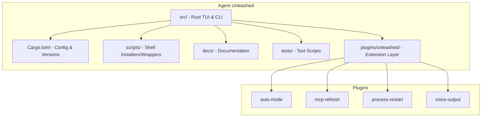
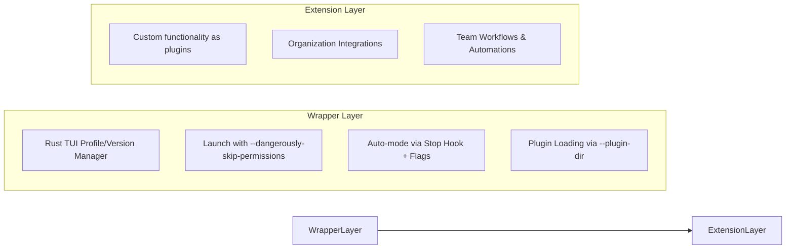

# Agent Unleashed


<p align="center">
  
</p>

A powerful extension framework for Claude Code with auto-mode, version management, and plugin support.

## Quick Install

```bash
# Using gh CLI (recommended - handles auth automatically)
gh repo clone heiervang-technologies/agent-unleashed /tmp/au && bash /tmp/au/scripts/install.sh && rm -rf /tmp/au
```
Or with GitHub token if repo is still private:
```bash
# export GH_TOKEN=ghp_xxx
curl -fsSL -H "Authorization: token $GH_TOKEN" \
  https://raw.githubusercontent.com/heiervang-technologies/agent-unleashed/main/scripts/install-remote.sh | bash
```

This installs/updates both **Claude Code** and **Agent Unleashed**.

**After install:**
```bash
au          # Show help and available commands
aug         # Start Claude with unleashed features (shorthand for 'au go')
aui         # TUI for profiles & version management
autx        # Headless mode for automation
```

> **Already have it installed?** Run the same command to update to latest versions.

---
<p align="center">
  
</p>
---

## Overview

**Agent Unleashed** is a wrapper around Anthropic's official [Claude Code](https://github.com/anthropics/claude-code) CLI that adds auto-mode, version management, and a plugin system — without modifying Claude Code itself.

This approach provides:
- **Zero upstream conflicts**: Uses Claude Code as-is via native binary or npm install
- **Auto-mode**: Stop hook + flag file system for autonomous operation (no cli.js patching)
- **Plugin ecosystem**: Add custom features, integrations, and workflows as plugins
- **Version management**: Install, switch, and manage Claude Code versions with whitelist/blacklist filtering
- **Team collaboration**: Share plugins across your organization

## Architecture



### How It Works

Agent Unleashed wraps Claude Code (installed separately via native binary or npm) and extends it through:



## Extension Approach: Plugin-First

All customizations are implemented as plugins. This keeps the core clean and makes features:
- **Modular**: Enable/disable features independently
- **Portable**: Share plugins across repositories
- **Maintainable**: Update plugins without touching core code
- **Testable**: Each plugin is isolated and testable

### Available Plugins

- **auto-mode**: Autonomous operation mode for Claude
- **mcp-refresh**: Automatically detect MCP configuration changes and notify for reload
- **process-restart**: Restart Claude Code while preserving session state and conversation history
- **voice-output**: Multi-provider text-to-speech for Claude's responses (VibeVoice, OpenAI, ElevenLabs)

## Version Management

Agent Unleashed manages Claude Code versions with configurable filtering:

- **Blacklist mode** (default for Claude): All versions allowed except known-bad ones
- **Whitelist mode** (default for Codex): Only verified versions allowed
- Version lists are maintained in `Cargo.toml` and compiled into the binary

## Quick Start

### Prerequisites

- curl (for native Claude Code binary download) or Node.js/npm (fallback)
- Git
- Rust/Cargo (optional, for building TUI from source)
- Claude Pro or Max subscription (required for authentication)

### Headless Environments

If you're running in a headless environment (Docker containers, Kubernetes pods, CI/CD pipelines), build without TUI support to avoid terminal dependencies:

```bash
cargo build --release --no-default-features
```

This creates a minimal binary without crossterm/ratatui dependencies that works perfectly in non-interactive environments. All commands (`auth`, `version`, `go`) work normally - only the `tui` command is disabled.

### One-Line Installation (Recommended)

Install everything with a single command:

```bash
curl -fsSL https://raw.githubusercontent.com/heiervang-technologies/agent-unleashed/main/scripts/install-remote.sh | bash
```

This will:
- Install Claude Code (native binary preferred, npm fallback)
- Download the pre-built TUI binary
- Set up `au`, `aug`, `autx`, and `aui` commands

### Installation Options

#### Option 1: gh CLI (recommended for private repo)
```bash
# Clone, install, cleanup
gh repo clone heiervang-technologies/agent-unleashed /tmp/au && \
  bash /tmp/au/scripts/install.sh && \
  rm -rf /tmp/au

# With specific Claude Code version
gh repo clone heiervang-technologies/agent-unleashed /tmp/au && \
  bash /tmp/au/scripts/install.sh --claude-version 2.1.5 && \
  rm -rf /tmp/au
```

#### Option 2: curl with GitHub token
```bash
# Set your GitHub token (needs repo access)
export GH_TOKEN=ghp_xxxxxxxxxxxx

# Install latest
curl -fsSL -H "Authorization: token $GH_TOKEN" \
  https://raw.githubusercontent.com/heiervang-technologies/agent-unleashed/main/scripts/install-remote.sh | bash

# Install specific Claude Code version
CLAUDE_CODE_VERSION=2.1.5 curl -fsSL -H "Authorization: token $GH_TOKEN" \
  https://raw.githubusercontent.com/heiervang-technologies/agent-unleashed/main/scripts/install-remote.sh | bash
```

#### Option 3: Clone and build from source
```bash
# Clone (SSH for private repo)
git clone git@github.com:heiervang-technologies/agent-unleashed.git
cd agent-unleashed

# Build TUI and install
cargo build --release
./scripts/install.sh

# Or without TUI
./scripts/install.sh --no-build
```

### Authentication Setup

Agent Unleashed requires authentication with Claude Code. You have two options:

#### Option 1: OAuth Token (Recommended for Automation)

Generate a long-lived OAuth token and set it as an environment variable:

```bash
# Generate the token
claude setup-token

# Copy the output token and export it
export CLAUDE_CODE_OAUTH_TOKEN=<your-token-here>

# Add to your shell profile for persistence
echo 'export CLAUDE_CODE_OAUTH_TOKEN=<your-token-here>' >> ~/.bashrc
# or ~/.zshrc for zsh
```

**Advantages:**
- Works in headless/non-interactive environments
- Suitable for CI/CD pipelines and containers
- No browser authentication needed
- Token persists across sessions when exported in shell profile

**Note:** The OAuth token takes precedence over credentials stored in `~/.claude/.credentials.json`.

#### Option 2: Interactive Authentication

Run Claude Code once to authenticate via browser:

```bash
claude
# Follow the browser authentication flow
# Credentials will be stored in ~/.claude/.credentials.json (Linux/Ubuntu)
# or macOS Keychain (macOS)
```

#### Verifying Authentication

Agent Unleashed automatically checks for authentication on startup. You can also verify authentication status manually:

```bash
# Quick check
au auth
# ✓ Authentication configured

# Detailed check
au auth --verbose
# ✓ Authentication configured
#
# Authentication method:
#   • OAuth token from CLAUDE_CODE_OAUTH_TOKEN environment variable
#   • Token preview: sk-ant-oat...g-1JzO1QAA
#
# Status: Ready to use Claude Code

# JSON output (for scripting)
au auth --json
# {"authenticated":true,"method":"oauth_token","details":null}

# Quiet mode (only exit code, no output)
au auth -q
# (no output, only exit code: 0=success, 1=failure)
```

The auth command verifies authentication without launching Claude, making it perfect for:
- CI/CD pipelines and automation scripts
- Pre-flight checks before running Claude
- Debugging authentication issues
- Integration with other tools

For more details, see the [Claude Code IAM documentation](https://code.claude.com/docs/en/iam).

### Add to PATH

After installation, add `~/.local/bin` to your PATH if not already:

```bash
export PATH="$HOME/.local/bin:$PATH"
# Add to your shell profile (~/.bashrc or ~/.zshrc) for persistence
```

## CLI Usage

### Command Overview

```bash
au                    # Show help and available commands
au go                 # Start Claude with unleashed features
au go --auto          # Start in autonomous mode
aug                   # Shorthand for 'au go'
aug --auto            # Shorthand for 'au go --auto'
au ui / aui           # Launch TUI interface
au tmux / autx        # Headless mode (see below)
au auth               # Check authentication status
au auth -v            # Check with detailed information
au auth -q            # Check quietly (only exit code)
au auth --json        # Output as JSON for scripting
au version            # Show installed version
au version --list     # List available versions
restart-claude        # Restart Claude (preserves session)
exit-claude           # Exit Claude cleanly
```

### Configuration Options

#### Stop Prompt Customization

Customize the message Claude receives when auto-mode blocks it from exiting:

```bash
# Set a custom prompt
aug --stop-prompt="Keep working until tests pass!"

# Edit with your $EDITOR
aug --stop-prompt-edit

# Reset to default
aug --stop-prompt-clear
```

You can also configure this via the TUI:
```bash
aui  # Navigate to Settings > Stop Prompt
```

The prompt is stored globally in `~/.config/agent-unleashed/config.toml` and applies to all future auto-mode sessions.

**Priority order:**
1. Session-specific override (programmatic)
2. Global config (CLI/TUI)
3. Default hardcoded message

For detailed configuration options, see [docs/extensions/configuration.md](docs/extensions/configuration.md).

## TUI Features

The TUI (`aui`) provides a graphical interface for managing Agent Unleashed:

### Profile Management
- Create and manage environment profiles
- Store API keys and environment variables securely
- Switch between profiles quickly

### Claude Code Version Management
- View currently installed Claude Code version
- Browse available versions from npm registry and GCS
- **Switch between versions** with a single selection
- Whitelist/blacklist filtering to avoid known-bad versions

Navigate with:
- `j/k` or `↑/↓` - Move selection
- `Enter` - Select/Confirm
- `Esc` - Go back
- `?` - Help

## Headless Mode (autx)

### Overview

`autx` is a headless mode for Agent Unleashed that runs Claude in a tmux session, enabling programmatic access for automation, scripting, and CI/CD pipelines. It provides a command-line interface to start, stop, send messages, and read responses from Claude without requiring an interactive terminal.

### When to Use It

- **CI/CD pipelines**: Integrate Claude into build and deployment workflows
- **Automation scripts**: Run Claude tasks from shell scripts or cron jobs
- **Background tasks**: Process files or analyze code without blocking the terminal
- **Programmatic access**: Build tools that interact with Claude programmatically
- **Batch processing**: Send multiple queries and collect responses

### Quick Examples

```bash
# Start a headless session
autx start

# Send a message to Claude
autx send "Analyze this code for bugs"

# Wait for Claude to finish responding
autx wait

# Read the response
autx read

# Or use the shorthand for quick queries (start, send, wait, read in one command)
autx "What is 2+2?"

# Attach to the session for interactive use
autx attach

# Check session status
autx status

# Stop the session
autx stop
```

### Environment Variables

| Variable | Default | Description |
|----------|---------|-------------|
| `AUTX_SESSION_NAME` | `agent-unleashed` | tmux session name |
| `AUTX_WAIT_TIMEOUT` | `300` | Default wait timeout in seconds |
| `AUTX_TERM_WIDTH` | `200` | Terminal width |
| `AUTX_TERM_HEIGHT` | `50` | Terminal height |
| `AUTX_STABLE_THRESHOLD` | `3` | Seconds of stable output to consider response complete |
| `AUTX_INIT_WAIT` | `5` | Seconds to wait for Claude initialization |

### Full Documentation

For detailed usage, advanced options, and integration examples, see [docs/extensions/headless-mode.md](docs/extensions/headless-mode.md).

## How to Add Plugins

### Creating a New Plugin

1. **Create plugin directory**
   ```bash
   mkdir -p plugins/my-plugin
   cd plugins/my-plugin
   ```

2. **Add plugin manifest** (`plugin.json`)
   ```json
   {
     "name": "my-plugin",
     "version": "1.0.0",
     "description": "Description of what your plugin does",
     "author": "Your Name",
     "main": "index.js",
     "hooks": {
       "pre-command": "./hooks/pre-command.js",
       "post-command": "./hooks/post-command.js"
     }
   }
   ```

3. **Implement plugin logic** (`index.js`)
   ```javascript
   module.exports = {
     name: 'my-plugin',

     async initialize(context) {
       // Setup code
       console.log('Plugin initialized');
     },

     async execute(command, args) {
       // Main plugin logic
       return { success: true };
     }
   };
   ```

4. **Enable in configuration**

   Add to `.claude/settings.json`:
   ```json
   {
     "plugins": {
       "enabled": ["my-plugin"]
     }
   }
   ```

### Plugin Development Best Practices

- Keep plugins focused on a single responsibility
- Document all configuration options
- Include tests for your plugin
- Follow semantic versioning
- Add a README.md to your plugin directory

See `docs/extensions/` for detailed plugin development guides.

## Documentation

- **Plugin Development**: `docs/extensions/plugin-development.md`
- **MCP Refresh & Process Restart**: `docs/extensions/restart-refresh.md`
- **GitHub Integration**: `docs/extensions/snail-integration.md`
- **Agent Instructions**: `CLAUDE.md`

## Contributing

We welcome contributions to both the plugin ecosystem and the wrapper infrastructure!

### Contribution Guidelines

1. **For new plugins:**
   - Create a new directory in `plugins/`
   - Include a README.md with usage instructions
   - Add tests for your plugin
   - Submit a PR with the plugin

2. **For wrapper/TUI improvements:**
   - Focus on the Rust source in `src/`
   - Update documentation
   - Add tests for new functionality

3. **For upstream improvements:**
   - Contribute directly to [anthropics/claude-code](https://github.com/anthropics/claude-code)

### Development Workflow

```bash
# 1. Create feature branch
git checkout -b feature/my-enhancement

# 2. Make changes
# - Add plugins in plugins/unleashed/
# - Modify Rust source in src/
# - Update configuration

# 3. Test your changes
cargo test

# 4. Commit with conventional commits
git commit -m "feat: add new plugin for X"

# 5. Push and create PR
git push origin feature/my-enhancement
```

### Code of Conduct

- Be respectful and inclusive
- Provide constructive feedback
- Help others learn and grow
- Maintain professional communication

## Troubleshooting

### Plugin not loading

1. Check `.claude/settings.json` - is it in `enabled` array?
2. Verify plugin structure - does it have `plugin.json` and `index.js`?
3. Check plugin logs for errors

## Organization

This repository is maintained by **Heiervang Technologies**.

- **Organization**: heiervang-technologies
- **GitHub**: [@heiervang-technologies](https://github.com/heiervang-technologies)

## License

This project maintains the same license as the upstream Claude Code project. See `LICENSE.md` for details.

## Acknowledgments

- **Anthropic** for creating and maintaining Claude Code
- **Heiervang Technologies** for the plugin architecture and wrapper infrastructure
- All contributors to the plugin ecosystem

## Links

- [Upstream Repository (anthropics/claude-code)](https://github.com/anthropics/claude-code)
- [Plugin Development Guide](docs/extensions/plugin-development.md)
- [Issue Tracker](https://github.com/heiervang-technologies/agent-unleashed/issues)
- [Discussions](https://github.com/heiervang-technologies/agent-unleashed/discussions)

---

**Ready to extend Claude Code?** Start by exploring the available plugins or create your own!
