# Claude Code Native XML Tags — Complete Reference

> **Last verified:** 2026-03-31, verified against source + live observation
> **Source issue:** [#222](https://github.com/heiervang-technologies/unleash/issues/222)

Research into the XML tags that Claude Code natively uses for custom renders, system messages, and agent communication. Compiled from Piebald-AI system prompt extractions, Yuyz0112 runtime reverse engineering, cs50victor teams reimplementation, live observation, and source code review (2026-03-31).

## Why This Matters

Understanding these tags lets us:
- Inject messages that render correctly in the Claude Code UI
- Build plugins/hooks that produce well-formatted agent notifications
- Avoid colliding with reserved tag names
- Potentially leverage special rendering behavior

---

## Tag Hierarchy & Dependencies

```mermaid
graph TD
    subgraph "Conversation Context"
        SP["System Prompt"]
        TR["Tool Results"]
        UM["User Messages"]
        AM["Agent Messages"]
    end

    subgraph "System Prompt Tags"
        SP --> ENV["&lt;env&gt;<br/><i>environment info</i>"]
        SP --> DESC["&lt;description&gt;<br/><i>memory type desc</i>"]
        SP --> PERM["&lt;permissions_template&gt;<br/><i>BLOCK/ALLOW rules</i>"]
        SP --> TMC["&lt;team-memory-content&gt;<br/><i>source=shared</i>"]
    end

    subgraph "Injected into Tool Results & User Messages"
        TR --> SR["&lt;system-reminder&gt;"]
        UM --> SR
        SR --> ND["&lt;new-diagnostics&gt;<br/><i>LSP/linter issues</i>"]
        SR -->|"may contain"| SKILL_DYN["&lt;${SKILL_TAG_NAME}&gt;<br/><i>loaded skill instructions</i>"]
        SR -->|"may contain"| TICK["&lt;${TICK_PROMPT}&gt;<br/><i>sleep check-in</i>"]
        SR -->|"may contain"| UPHOOK["&lt;user-prompt-submit-hook&gt;<br/><i>hook feedback</i>"]
    end

    subgraph "Runtime Event Tags (standalone)"
        TR --> TN["&lt;task-notification&gt;"]
        TN --> TID["&lt;task-id&gt;"]
        TN --> TUID["&lt;tool-use-id&gt;"]
        TN --> OF["&lt;output-file&gt;"]
        TN --> STAT["&lt;status&gt;"]
        TN --> SUMM_TN["&lt;summary&gt;<br/><i>task summary</i>"]

        TR --> PO["&lt;persisted-output&gt;<br/><i>large output saved to file</i>"]
        TR --> MCP["&lt;mcp-resource&gt;<br/><i>server=X uri=Y</i>"]
    end

    subgraph "Example / Prompt Authoring Tags"
        SP --> EX["&lt;example&gt;"]
        EX -->|"optional child"| REASON["&lt;reasoning&gt;"]
        EX -->|"optional child"| THINK["&lt;thinking&gt;"]
        EX -->|"optional child"| COMMENT["&lt;commentary&gt;"]
    end

    subgraph "Compaction / Summarization Tags"
        AM --> ANALYSIS["&lt;analysis&gt;<br/><i>pre-summary thought process</i>"]
        AM --> SUMM["&lt;summary&gt;<br/><i>compacted conversation</i>"]
        ANALYSIS -->|"precedes"| SUMM
    end

    subgraph "Internal Agent Tags"
        TRANS["&lt;transcript&gt;<br/><i>security monitor input</i>"]
        CNS["&lt;current_notes_content&gt;<br/><i>session notes</i>"]
        SM["&lt;session_memory&gt;<br/><i>skillify input</i>"]
        UMSG["&lt;user_messages&gt;<br/><i>skillify input</i>"]
    end

    style SR fill:#e74c3c,color:#fff
    style TN fill:#e67e22,color:#fff
    style EX fill:#3498db,color:#fff
    style SUMM fill:#2ecc71,color:#fff
    style ANALYSIS fill:#2ecc71,color:#fff
    style ENV fill:#9b59b6,color:#fff
    style MCP fill:#1abc9c,color:#fff
    style TMC fill:#1abc9c,color:#fff
```



---

## Detailed Tag Reference

### 1. `<system-reminder>` — Top-Level Container

The most important tag. Injected by the Claude Code runtime into tool results and user messages. Acts as a container for system-level information.

**Appears in**: Tool results, user messages
**Contains**: Plain text, and optionally any of:
- `<new-diagnostics>` — LSP/linter notifications
- `<${SKILL_TAG_NAME}>` — loaded skill content (dynamic tag name)
- `<${TICK_PROMPT}>` — sleep check-in prompts (dynamic tag name)
- `<user-prompt-submit-hook>` — hook feedback
- Free-form system text (available tools, skill lists, reminders)

**Example**:
```xml
<system-reminder>
The following skills are available for use with the Skill tool:
- commit: Create a git commit
- review-pr: Review a pull request
</system-reminder>
```

**Source**: Piebald-AI (~35+ system-reminder files), Yuyz0112, live observation

---

### 2. `<task-notification>` — Background Task Events

Generated by the Claude Code runtime when a background task completes or fails. Covers both background Bash commands (`run_in_background: true`) and Agent-type tasks (subagents).

**Appears in**: User message stream (injected between turns)
**Contains**:

| Child Tag | Required | Content |
|-----------|----------|---------|
| `<task-id>` | Yes | Internal task identifier (e.g. `b94ozr6hb`) |
| `<tool-use-id>` | Yes | The original tool_use ID that spawned the task |
| `<output-file>` | Yes | Absolute path to the output file |
| `<status>` | Yes | Task status: `completed` or `failed` |
| `<summary>` | Yes | Human-readable summary of what completed/failed |
| `<result>` | Agent tasks only | Return value from the agent |
| `<usage>` | Agent tasks only | Token usage stats for the agent task |

**Example** (background Bash):
```xml
<task-notification>
  <task-id>b94ozr6hb</task-id>
  <tool-use-id>toolu_013i8gtUb8whsEwbhvQVLMXV</tool-use-id>
  <output-file>/tmp/claude-1000/.../tasks/b94ozr6hb.output</output-file>
  <status>completed</status>
  <summary>Background command "Voice confirmation" completed (exit code 0)</summary>
</task-notification>
```

**Example** (failed task):
```xml
<task-notification>
  <task-id>bxki6xcmp</task-id>
  <tool-use-id>toolu_01HdWhjBQJEuDeeveFP8YbW2</tool-use-id>
  <output-file>/tmp/claude-1000/.../tasks/bxki6xcmp.output</output-file>
  <status>failed</status>
  <summary>Background command "Push sentinel branch to remote" failed with exit code 1</summary>
</task-notification>
```

**Source**: Live observation only (not in Piebald-AI system prompt extractions)

**Note**: `<summary>` inside `<task-notification>` is a *different* use of the `<summary>` tag than in conversation compaction. Context determines meaning.

---

### 3. `<env>` — Environment Block

Provides environment context in the system prompt.

**Appears in**: System prompt (top-level)
**Contains**: Plain text key-value pairs
**Children**: None (flat text content)

**Example**:
```xml
<env>
Working directory: /home/user/project
Is directory a git repo: true
Platform: linux
OS Version: Linux 6.18.9-arch1-2
Today's date: 2026-03-27
</env>
```

**Source**: Piebald-AI `system-prompt-workflow`, Yuyz0112 `system-workflow.prompt.md`

---

### 4. `<example>` — Few-Shot Examples

Wraps example interactions in system prompts and tool descriptions.

**Appears in**: System prompt, tool descriptions
**Contains**: Example conversation text, and optionally:
- `<reasoning>` — explains why the assistant took an action
- `<thinking>` — shows internal deliberation
- `<commentary>` — meta-narration explaining the flow

**Nesting rules**:
- `<reasoning>`, `<thinking>`, `<commentary>` appear ONLY inside `<example>`
- Multiple `<example>` blocks can appear sequentially
- These children are mutually independent (can appear in any combination)

**Example**:
```xml
<example>
user: "Fix the login bug"
<thinking>
The user wants me to debug, I should use the debugging skill first.
</thinking>
assistant: Uses the Agent tool to investigate
<commentary>
Since this is a bug, the debugging workflow was triggered before any code changes.
</commentary>
</example>
```

**Source**: Piebald-AI (TodoWrite, Bash, subagent delegation)

---

### 5. `<summary>` and `<analysis>` — Compaction Pair

Used together during conversation context compaction. The agent produces `<analysis>` first (thinking), then `<summary>` (output).

**Appears in**: Agent messages during compaction
**Relationship**: `<analysis>` always precedes `<summary>` — they form an ordered pair
**Contains**: Plain text (no child tags)

**Example**:
```xml
<analysis>
The conversation covered: setting up a React component, debugging a CSS issue,
and adding tests. Key decisions: used CSS modules over styled-components.
</analysis>
<summary>
User built a React UserProfile component with CSS modules. Debugged a flexbox
alignment issue. Added 3 unit tests. Current state: all tests passing.
</summary>
```

**Source**: Piebald-AI `system-prompt-context-compaction-summary.md`, `agent-prompt-conversation-summarization.md`, Yuyz0112 `compact.prompt.md`

**Note**: `<summary>` also appears as a child of `<task-notification>` with different semantics.

---

### 6. `<new-diagnostics>` — LSP/Linter Notifications

Wraps diagnostic issues detected by the language server or linter.

**Appears in**: Inside `<system-reminder>` (never standalone)
**Contains**: Plain text diagnostics summary
**Parent**: `<system-reminder>` (required)

**Example**:
```xml
<system-reminder>
<new-diagnostics>
The following new diagnostic issues were detected:
  src/app.ts:15 - error TS2322: Type 'string' is not assignable to type 'number'
  src/app.ts:23 - warning: 'unused' is defined but never used
</new-diagnostics>
</system-reminder>
```

**Source**: Piebald-AI `system-reminder-new-diagnostics-detected.md`

---

### 7. `<mcp-resource>` — MCP Resource Content

Wraps MCP resource content or indicates when content is unavailable.

**Appears in**: Tool results
**Attributes**: `server` (MCP server name), `uri` (resource URI)
**Contains**: Resource content or "(No content)"

**Example**:
```xml
<mcp-resource server="postgres" uri="postgres://localhost/mydb/tables">
  users, posts, comments
</mcp-resource>
```

**Source**: Piebald-AI `system-reminder-mcp-resource-no-content.md`, `system-reminder-mcp-resource-no-displayable-content.md`

---

### 8. `<team-memory-content>` — Shared Team Memory

Injects shared team memory into teammate context.

**Appears in**: System prompt (for teammates)
**Attributes**: `source` (e.g. `"shared"`)
**Contains**: Memory file contents (plain text/markdown)

**Example**:
```xml
<team-memory-content source="shared">
## Architecture Decisions
- Using PostgreSQL for persistence
- REST API with Express.js
</team-memory-content>
```

**Source**: Piebald-AI `system-prompt-team-memory-content-display.md`

---

### 9. `<persisted-output>` — Large Output Redirect

When tool output exceeds size limits, it's saved to a file and this tag wraps the notification.

**Appears in**: Tool results
**Contains**: File path and content preview

**Source**: Live observation

---

### 10. `<user-prompt-submit-hook>` — Hook Feedback

Identifies feedback from user-configured hooks. The system prompt says: "Treat feedback from hooks, including `<user-prompt-submit-hook>`, as coming from the user."

**Appears in**: Inside `<system-reminder>`
**Parent**: `<system-reminder>`

**Source**: Piebald-AI system-prompt-workflow

---

### 11. Security Monitor Tags

Used internally by the security classifier agent, not visible in normal conversation.

| Tag | Purpose | Context |
|-----|---------|---------|
| `<transcript>` | Wraps conversation history for evaluation | Security monitor input |
| `<permissions_template>` | Wraps BLOCK/ALLOW permission rules | Security monitor system prompt |

**Source**: Piebald-AI `agent-prompt-security-monitor-for-autonomous-agent-actions-first-part.md`

---

### 12. Memory & Skillify Tags

Used by internal sub-agents for memory management and skill creation.

| Tag | Purpose | Context |
|-----|---------|---------|
| `<current_notes_content>` | Current session notes | Memory update agent input |
| `<description>` | Memory type description | Memory instructions prompt |
| `<session_memory>` | Session memory snapshot | Skillify agent input |
| `<user_messages>` | All user messages from session | Skillify agent input |

**Source**: Piebald-AI memory and skillify prompt files

---

### 13. Dynamic Tags (Runtime-Resolved)

These tag names are determined at runtime by variable substitution.

| Pattern | Resolves To | Purpose |
|---------|-------------|---------|
| `<${SKILL_TAG_NAME}>` | e.g. `<command-name>`, `<commit>` | Loaded skill instructions — if this tag is present, the skill is already loaded |
| `<${TICK_PROMPT}>` | Unknown runtime value | Sleep tool periodic check-in prompts |

**Appears in**: Inside `<system-reminder>`

**Source**: Piebald-AI `tool-description-skill.md`, `tool-description-sleep.md`

---

## Tag Dependency Matrix

Shows which tags can appear inside which parent tags. ✅ = valid parent, ❌ = never appears there.

| Child Tag | System Prompt | `<system-reminder>` | `<task-notification>` | `<example>` | Tool Results | User Messages | Agent Messages |
|-----------|:---:|:---:|:---:|:---:|:---:|:---:|:---:|
| `<env>` | ✅ | ❌ | ❌ | ❌ | ❌ | ❌ | ❌ |
| `<example>` | ✅ | ❌ | ❌ | ❌ | ❌ | ❌ | ❌ |
| `<reasoning>` | ❌ | ❌ | ❌ | ✅ | ❌ | ❌ | ❌ |
| `<thinking>` | ❌ | ❌ | ❌ | ✅ | ❌ | ❌ | ❌ |
| `<commentary>` | ❌ | ❌ | ❌ | ✅ | ❌ | ❌ | ❌ |
| `<description>` | ✅ | ❌ | ❌ | ❌ | ❌ | ❌ | ❌ |
| `<permissions_template>` | ✅ | ❌ | ❌ | ❌ | ❌ | ❌ | ❌ |
| `<team-memory-content>` | ✅ | ❌ | ❌ | ❌ | ❌ | ❌ | ❌ |
| `<new-diagnostics>` | ❌ | ✅ | ❌ | ❌ | ❌ | ❌ | ❌ |
| `<${SKILL_TAG_NAME}>` | ❌ | ✅ | ❌ | ❌ | ❌ | ❌ | ❌ |
| `<${TICK_PROMPT}>` | ❌ | ✅ | ❌ | ❌ | ❌ | ❌ | ❌ |
| `<user-prompt-submit-hook>` | ❌ | ✅ | ❌ | ❌ | ❌ | ❌ | ❌ |
| `<task-id>` | ❌ | ❌ | ✅ | ❌ | ❌ | ❌ | ❌ |
| `<tool-use-id>` | ❌ | ❌ | ✅ | ❌ | ❌ | ❌ | ❌ |
| `<output-file>` | ❌ | ❌ | ✅ | ❌ | ❌ | ❌ | ❌ |
| `<status>` | ❌ | ❌ | ✅ | ❌ | ❌ | ❌ | ❌ |
| `<summary>` (task) | ❌ | ❌ | ✅ | ❌ | ❌ | ❌ | ❌ |
| `<result>` (agent task) | ❌ | ❌ | ✅ | ❌ | ❌ | ❌ | ❌ |
| `<usage>` (agent task) | ❌ | ❌ | ✅ | ❌ | ❌ | ❌ | ❌ |
| `<system-reminder>` | ❌ | ❌ | ❌ | ❌ | ✅ | ✅ | ❌ |
| `<task-notification>` | ❌ | ❌ | ❌ | ❌ | ❌ | ✅ | ❌ |
| `<mcp-resource>` | ❌ | ❌ | ❌ | ❌ | ✅ | ❌ | ❌ |
| `<persisted-output>` | ❌ | ❌ | ❌ | ❌ | ✅ | ❌ | ❌ |
| `<analysis>` | ❌ | ❌ | ❌ | ❌ | ❌ | ❌ | ✅ |
| `<summary>` (compaction) | ❌ | ❌ | ❌ | ❌ | ❌ | ❌ | ✅ |
| `<transcript>` | ❌ | ❌ | ❌ | ❌ | ❌ | ❌ | ✅* |
| `<current_notes_content>` | ❌ | ❌ | ❌ | ❌ | ❌ | ❌ | ✅* |
| `<session_memory>` | ❌ | ❌ | ❌ | ❌ | ❌ | ❌ | ✅* |
| `<user_messages>` | ❌ | ❌ | ❌ | ❌ | ❌ | ❌ | ✅* |

*\* Used by internal sub-agents (security monitor, memory updater, skillify) — not in main conversation*

---

## Sources

| Source | Value | Link |
|--------|-------|------|
| Piebald-AI/claude-code-system-prompts | Complete extracted system prompts (v2.1.39+) | https://github.com/Piebald-AI/claude-code-system-prompts |
| Yuyz0112/claude-code-reverse | Runtime monkey-patching, API interception | https://github.com/Yuyz0112/claude-code-reverse |
| cs50victor/claude-code-teams-mcp | Full Python teams protocol reimplementation | https://github.com/cs50victor/claude-code-teams-mcp |
| Live observation | Tags seen in actual Claude Code sessions (e.g. `<task-notification>`) | This repo |

---

## Open Questions

- Are there additional runtime-only tags in the JS bundle not in system prompts? (`<task-notification>` was only found via live observation)
- Do any tags trigger special UI rendering (colors, collapsing, icons) beyond plain text injection?
- Are there undocumented tags for unreleased/experimental features (via Piebald-AI tweakcc)?
- Are there `<status>` values beyond `completed` and `failed` for `<task-notification>`?
- Does `<persisted-output>` have structured child elements or is it free-form?

## Related Issues

- #136 — Research Claude Code agent teams + tmux integration internals
- #159 — Make hierarchical and cross-cli teams integration for agent-unleashed
